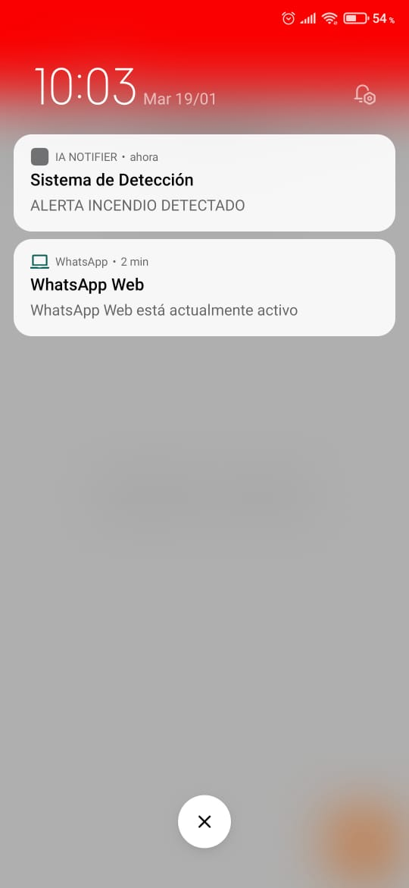
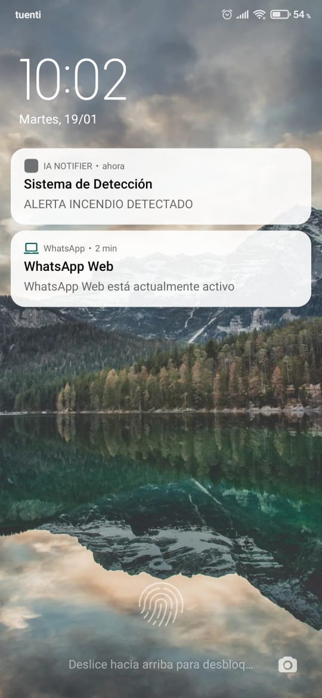
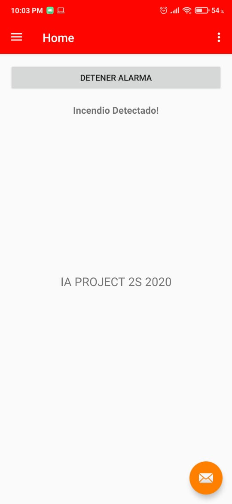

# Detección de Incendios (App Móvil)

Aplicación móvil android diseñada para alertar a los usuarios cuando el servicio encargado de analizar las imagenes usando la red CNN detecte un posible incendio en la imagen analizada.

# Pre-requisitos

- Adroid Studio 3.8 o Superior
- Emulador o Dispositivo android 

# Instalación

1. Clone el repo.

```sh
git clone https://github.com/DeteccionDeIncendios/mobilApp.git
```

2. Ejecute el proyecto usando android Studio.

3. En caso de que no se desee ejecutar el proyecto, se adjunta el archivo APK más actual en el directorio principal de este repositorio, basta con instalar el archivo en un dispositivo android.

# Uso

Mediante las aplicaciones de back y front se puede cargar una imagen, en caso de que el back detecte que esa imagen es un posible incendio, la aplicación lanzará una notificación y una alarma, la cual es el sonido que el usuario tenga configurado para llamadas por defecto.

A continuación se muestra un ejemplo cuando la aplicación recibe una notifiación de incendio.

1. Ejemplo 1: Notificación recibida y expuesta en la barra de notificaciones.




2. Ejemplo 2: Notificación recibida y expuesta en la pantalla de bloqueo.




3. Ejemplo 3: Interfaz principal de la apliación, además de recibir la notificación y encender la alarma, al ingresar en la app se le da la opción de detener dicha alarma.


